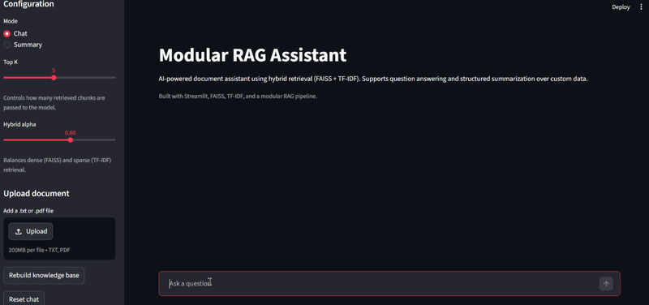
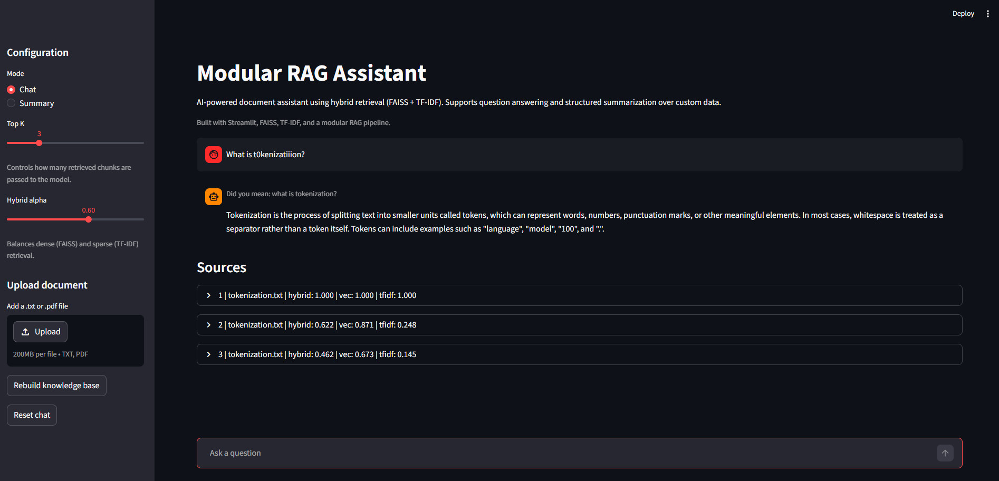

# Modular RAG Assistant

A fully modular Retrieval-Augmented Generation (RAG) system built from scratch, designed to resemble real-world production pipelines.

This project demonstrates how modern LLM-based systems combine retrieval, ranking, and controlled generation to answer questions based on custom data.

---

## Overview

This system allows you to:

- Ask questions over your own documents  
- Generate answers grounded strictly in retrieved context  
- Create structured summaries of knowledge  
- Dynamically expand the knowledge base with new files  
- Inspect retrieval results and debug the pipeline  
- Handle noisy queries (e.g. typos) with automatic correction  

The architecture follows a modular RAG design inspired by recent research.
---
## Demo



Example of typo-tolerant query handling and grounded answer generation.

If the animation does not load:



---

## Architecture

The pipeline is divided into independent modules:
```
Pre-Retrieval
↓
Query Processing (rewrite + typo correction)
↓
Retrieval<br>
↓
Hybrid Search (FAISS + TF-IDF)
↓
Post-Retrieval
↓
Reranking + Filtering + Context Validation
↓
Generation
↓
LLM (Ollama - local)
↓
Orchestration
↓
Pipeline (chat / summary)
```
---

## Key Features

### Hybrid Retrieval
- Dense search (FAISS + embeddings)
- Sparse search (TF-IDF)
- Score fusion with normalization

### Query Processing
- Lightweight query rewriting
- Typo correction using vocabulary and fuzzy matching
- Improves robustness for noisy user input

### Reranking
- Combines semantic similarity and keyword overlap
- Improves precision of retrieved results

### Hallucination Control
- Context validation before generation
- Refuses to answer when information is insufficient

### Local LLM
- Runs fully locally via Ollama
- No external API required

### Dynamic Knowledge Base
- Upload `.txt` files via UI
- Rebuild index on demand

### Evaluation
- Custom test queries
- Metrics: Top-1, Top-3, Top-5 hit rate, MRR, Recall@k

### Streamlit UI
- Chat interface
- Summary mode
- Source inspection
- Query correction suggestions ("Did you mean ...")

---

## Project Structure
```
rag/
├── indexing/        # chunking, embeddings, FAISS index
├── retrieval/       # dense, sparse, hybrid search
├── pre_retrieval/   # query rewriting and correction
├── post_retrieval/  # reranking, filtering, context building
├── generation/      # prompts + LLM calls
├── orchestration/   # main pipeline logic
├── utils/           # loading, history handling
├── config.py        # configuration

evaluation/
├── test_cases.py
├── evaluate.py

app.py               # Streamlit UI
```
---

## How It Works

1. Documents are loaded and split into chunks  
2. Chunks are embedded and indexed (FAISS + TF-IDF)  
3. User query is processed (including typo correction)  
4. Hybrid retrieval returns candidate documents  
5. Results are reranked and filtered  
6. Context is constructed from top results  
7. LLM generates an answer strictly based on context  

---

## Example Queries

- What is TF-IDF?  
- Explain RAG architecture  
- What is the difference between dense and sparse retrieval?  
- What is t0kenization?  

---

## Running the Project

### 1. Install dependencies

pip install -r requirements.txt

### 2. Start Ollama

ollama run llama3  
ollama pull nomic-embed-text  

### 3. Build knowledge base

python -m rag.indexing.builder  

### 4. Run the app

streamlit run app.py  

---

## Tech Stack

- Python  
- FAISS  
- Scikit-learn (TF-IDF)  
- Ollama  
- Streamlit  

---

## Author

Bartłomiej Jamiołkowski  
